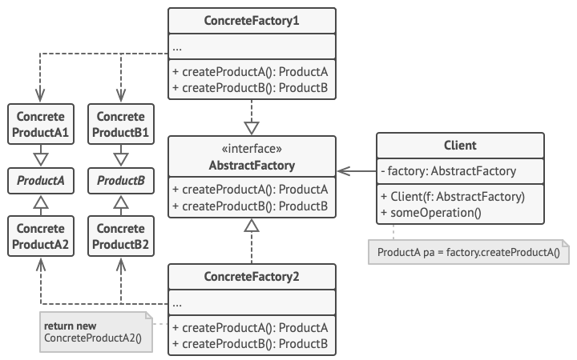

Abstract Factory is a creational design pattern that lets you produce **families of related objects** without specifying their concrete classes.

Use the Abstract Factory when your code needs to work with **various families of related products**, but you don't want it to depend on the concrete classes of those products—they might be unknown beforehand or you simply want to allow for future extensibility.
