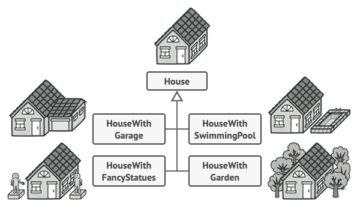

Builder is a creational design pattern that lets you **construct complex objects step by step**. The pattern allows you to produce different types and representations of an object using the same construction code.

- Use the Builder pattern to get rid of a "telescopic constructor".
- Use the Builder pattern when you want your code to be able to create different representations of some product (for example, stone and wooden houses).
- Use the Builder to construct Composite trees or other complex objects.
