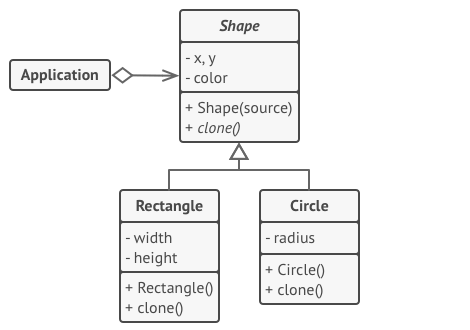

Prototype is a creational design pattern that lets you copy existing objects without making your code dependent on their classes.

- Use the Prototype pattern when your code shouldn't depend on the concrete classes of objects that you need to copy.
- Use the pattern when you want to reduce the number of subclasses that only differ in the way they initialize their respective objects. Somebody could have created these subclasses to be able to create objects with a specific configuration.
