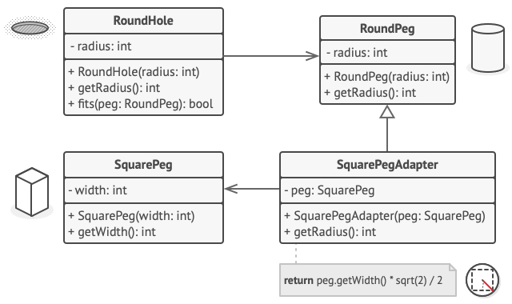

Adapter is a structural design pattern that allows objects with incompatible interfaces to collaborate.

- Use the Adapter class when you want to use some existing class, but its interface isn't compatible with the rest of your code.
- Use the pattern when you want to reuse several existing subclasses that lack some common functionality that can't be added to the superclass.
