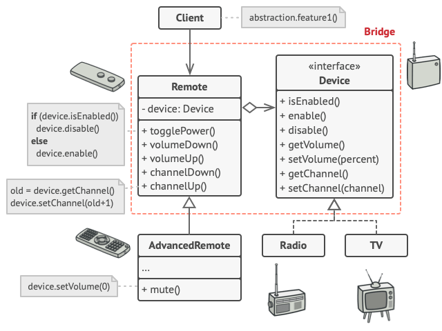

Bridge is a structural design pattern that lets you split a large class or a set of closely related classes into two separate hierarchies—abstraction and implementation—which can be developed independently of each other.

- Use the Bridge pattern when you want to divide and organize a monolithic class that has several variants of some functionality (for example, if the class can work with various database servers).
- Use the pattern when you need to extend a class in several orthogonal (independent) dimensions.
- Use the Bridge if you need to be able to switch implementations at runtime.
