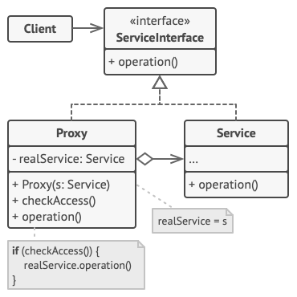

Proxy is a structural design pattern that lets you provide a substitute or placeholder for another object. A proxy controls access to the original object, allowing you to perform something either before or after the request gets through to the original object.

- Lazy initialization (virtual proxy). This is when you have a heavyweight service object that wastes system resources by being always up, even though you only need it from time to time.
- Access control (protection proxy). This is when you want only specific clients to be able to use the service object; for instance, when your objects are crucial parts of an operating system and clients are various launched applications (including malicious ones).
- Local execution of a remote service (remote proxy). This is when the service object is located on a remote server.
- Logging requests (logging proxy). This is when you want to keep a history of requests to the service object.
- Caching request results (caching proxy). This is when you need to cache results of client requests and manage the life cycle of this cache, especially if results are quite large.
- Smart reference. This is when you need to be able to dismiss a heavyweight object once there are no clients that use it.
