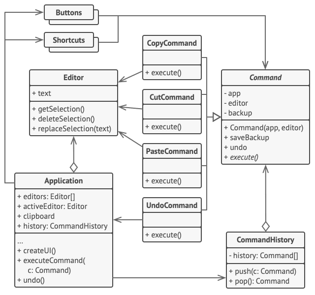

Command is a behavioral design pattern that turns a request into a stand-alone object that contains all information about the request. This transformation lets you pass requests as a method arguments, delay or queue a request's execution, and support undoable operations.

- Use the Command pattern when you want to parametrize objects with operations.
- Use the Command pattern when you want to queue operations, schedule their execution, or execute them remotely.
- Use the Command pattern when you want to implement reversible operations.
