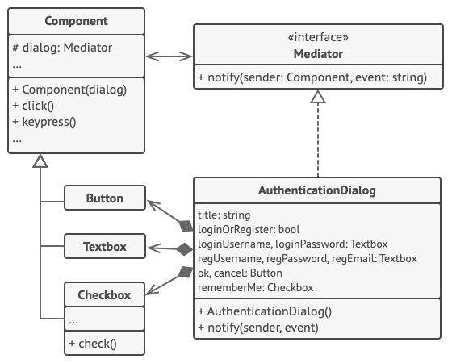

Mediator is a behavioral design pattern that lets you reduce chaotic dependencies between objects. The pattern restricts direct communications between the objects and forces them to collaborate only via a mediator object.

- Use the Mediator pattern when it's hard to change some of the classes because they are tightly coupled to a bunch of other classes.
- Use the pattern when you can't reuse a component in a different program because it's too dependent on other components.
- Use the Mediator when you find yourself creating tons of component subclasses just to reuse some basic behavior in various contexts.
