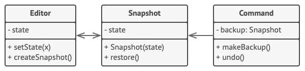

Memento is a behavioral design pattern that lets you save and restore the previous state of an object without revealing the details of its implementation.

- Use the Memento pattern when you want to produce snapshots of the object's state to be able to restore a previous state of the object.
- Use the pattern when direct access to the object's fields/getters/setters violates its encapsulation.
